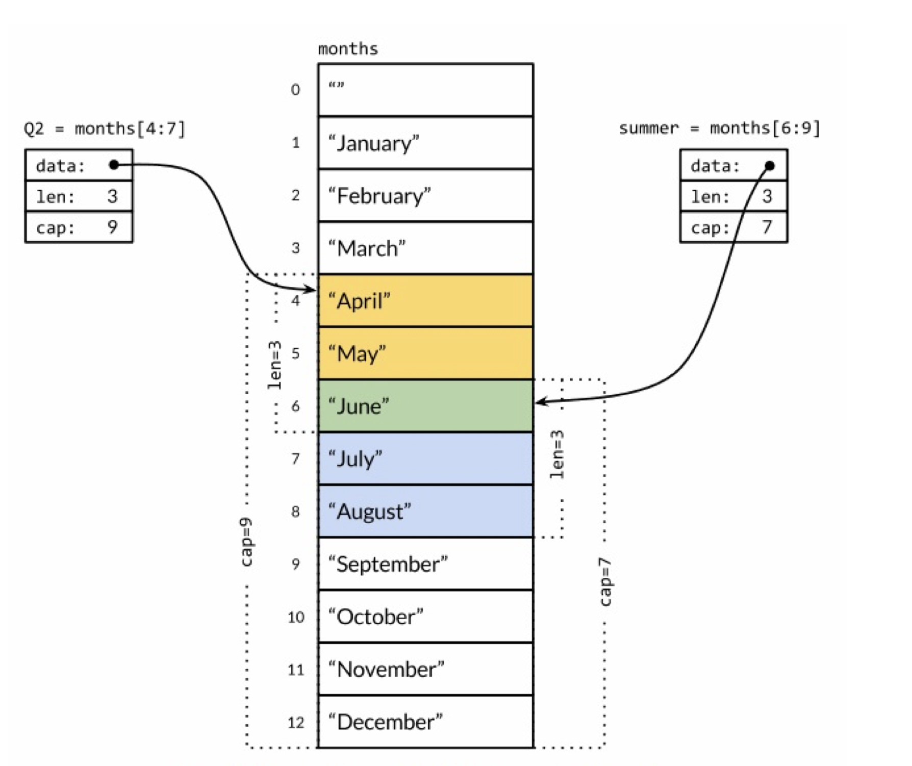

# Go | 基础学习


### 变量声明

- 方式一：使用关键字`var`，语法是`var 变量 变量类型`，如`var s string`，该变量隐式初始化，字符串是空字符串`""`，数值类型是0
- 方式二：短变量声明`:=`，符号左侧是变量名，右侧是变量值，如`i := 0`，该种方式只能用于函数内部

### 指针

- 指针的值是一个变量的地址

- 通过取地址符`&`获取变量的地址，产生指向该变量的指针

    ```
    a := 10
    p = &a   // p 是一个指针 指向 a，其类型是 *int
    ```

- 通过`*`获取该地址的数据，`*p`的值为 10

- new：除了通过`&`来获取指针，也可以使用`new()`，它的作用是根据传递的类型，分配一片内存地址，并返回指向该地址的指针

    ```go
    var a int
    p := &a
    
    p := new(int)
    // 上面两种效果一致
    ```

### 自增语句

- Go 中的自增语句与其他类C语言不同，不存在左自增或自减，也就是说`—-i`与`++i`都是错误语法。同时，在 Go 中`i++`或`i-—`属于语句，而不是表达式，所以`j = i++`也属于错误语法。

### 循环语句

- 在 Go 中只存在一种循环语句`for`，利用`for`的不同使用形式可以模拟`for、while、forEach`等循环方式。

- 格式与 C 语言类似，包括了初始语句、循环判断语句、循环后执行语句，这三个部分每个部分都可以省略。

- forEach 形式的循环，利用`range`声明，声明后跟一个数组，数组元素会被分解成索引和值赋给左侧的变量，如下：

  ```go
  for k, v := range a {
    fmt.Printf("k=%d, v=%s\n", k, v)
  }
  ```

  注意，`range`会分解出索引和值，不允许省略索引。所以在Go中如果你在逻辑中不需要用到索引时必须使用空标志符

  ```go
  for _, v := range a {
    fmt.Printf("v=%s\n", v)
  }
  ```

### 控制语句

- `if`控制语句，与`for`一致，if 的判断逻辑不需要使用`()`包裹，但是代码块需要使用`{}`包裹，且`{`与`if`位置一致，`}`新起一行，如：

  ```go
  if index > 10 {
    fmt.Println("hhhh")
  }
  ```

- `switch`控制语句，与其他语言不同的是Go语言的case不需要显示的声明break结束语句，Go默认执行完匹配的case后自动结束语句，Go 也允许case 后列出多个条件，当满足其中一个都会执行，如：

  ```go
  switch x {
  	case x == 1 :
  	  fmt.Println("h")
    case x == 2, x == 3:
  	  fmt.Println("b")
    default:
  	  fmt.Println("c")
  }
  ```

### 打印

- Println

- Printf

  - 通常有多少个 % 参数，就需要对应相同数量的操作数，但是可以使用`[1]`来表示使用第一个操作数( [n] 使用第 n 个操作数)

  ```go
  i := 10
  fmt.Printf("%d = %d",  i); // print 10 = 10
  ```

  * 在 `%o、%x、%X`使用 # 表示输出生成0、0x、0X前缀

### 基本数据类型

- 整型：包括有符号和无符号，对应8、16、32、64bit的整数，用`int8、int16、int32、int64、uint8、uint16、uint32、uint64`表示。

- Byte: 可以表示一个字符，可以与 int8 进行转换

- 浮点数：包括两种精度的浮点数，float32 和 float64，通过 math 包的 MaxFloat32 和 MaxFloat64 获取 float32 和 float64 的最大数值。float32 提供6个十进制精度，float64约提供 15个十进制的精度，一般推荐使用float64来进行操作。

- 复数：使用complex64 和 complex64 来对应 float32 和 float64，复数可以使用complex函数来进行构建，也可以直接构建`re + mi`。使用real函数和imag函数返回复数的实部和虚部

  ```go
  var a complex128 = complex(1, 2)  // i + 2i
  var b complex128 = 1 + 2i
  r := real(a)   // 1.000000
  m := imag(a)   // 2.000000
  ```

- 布尔型：true 和 false

- 字符串：使用`"`表示一个字符串，使用`'`表示一个字符，可以像数组把一样传入索引值返回对应的字符。特殊的使用方式是使用切片，如`s[i:j]`表示返回字符串 s 从第 i **字节**到 第 j  **字节**之前的字符串(所以对于中文等多字节字符串要注意)，i 或 j 均可以忽略，忽略时分别取 0 或 len(s)；字符串是不可变得变量，增加或修改会导致新字符串的产生。因为这种不可变性，所以不可以和数组一样通过索引修改其值。

  - 使用`len`获取字节长度，想要获取一个多字节字符串的长度可以使用`unicode/utf8`包中的`RuneCountInString`方法，另外 for 循环中的 range 会隐式对多字节字符串进行解码
  - 使用`strconv.Itoa`将 int 转为 string，使用`strconv.Atoi`将 string 转为 int

- Rune: int32 的别名，由上面所述，`s[i:j]`截取的是i 到 j 字节的字符，对于中文截取不是很好用，可以使用 `[]rune`，因为rune是四个字节，因此对于中文截取来说不用担心截取错误了，如：
  
    ```go
    s := "你好，世界"
    r := []rune(s)
    fmt.Println(string(r[0:2])) // Print 你好
  ```
  
- 常量：使用`const`关键字声明常量，常量的值在编译期计算，常量的定义只能是基础类型，boolean、string 或 数字。常量定义后不允许修改。
  
  - 常量定义可以从第二个开始省略右侧表达式，后面的定义会使用前面常量的初始化表达式：
  
      ```go
      const (
        a = 1
        b
        c
        d = 2
        e
      )    // a、b、c值都是1，d、e值都是2
    ```
  
  - iota 常量生成器：iota 开始被置为0，每一个常量使用它，数值会增加1，利用上面所述特性配置 iota 可以生成一组有特殊规则的常量。

### 复合数据类型

* 数组：Go 数组在声明后长度不可改变

  * 数组声明：`var a [10] string`

  * 数组初始化：

    ```go
    for i := 0; i < len(a); i++ {
        a[i] = "a"
    }
    ```

  * 声明并初始化：

    ```go
    var a = [3]string{"a", "b", "c"}
    // 使用省略号忽略长度设置，go在编译器会自动计算
    var b = [...]string{"a", "b", "c"} 
    ```

  * 声明时指定位置的元素

    ```go
    a := [...]int{0:1, 2:1, 4:1}   // [1,0,1,0,1]
    ```

  * 数组类型比较：数组类型的比较包含数组的长度，`[3]int` 和 `[4]int`不是一个类型

  * 函数中数组变量的传递是值传递，传递的是原变量的拷贝，如果希望在函数中操作原数组的值可以传递数组指针

  * `a[2:3]`返回的值切片slice：

    ```go
    a := [...]int{1,2,3,4}
    b := a[2:3]
    b = append(b, 5)
    // 改变数组的切片会影响原数组
    fmt.Println(a, reflect.TypeOf(a), s, reflect.TypeOf(s))  
    // [1 2 3 5] [4]int [3 5] []int
    ```

* Slice：切片，与数组类似，不同的是切片是变长序列

  * 定义：

    ```go
    // Slice 的定义不需要指定长度
    a := []int{1,2,3}
    b := make([]int, 3)
    ```

  * 结构：由指针、长度、容量三部分组成，指针指向切片的第一个元素，长度是指当前切片元素数量，容量是指该切片能容纳多少数量的元素，超过最大长度会对Slice进行扩展，超过容量会导致报错；当切片从数组而来，其指针指向数组中的元素，此时改变切片中元素内容会同步修改数组，其对应的关系如下图：

    

  * 比较：与数组不同，Splice不能直接比较，除了`[]byte`类型的可以使用`bytes`包的`Equal`函数进行比较，其他类型如要进行比较，需要自行写代码。（允许可以 `nil`进行比较）

* Map：

  * 定义：

    ```go
    // 通过make
    a := make(map[int]string)
    a[1024] = "程序员"
    // 直接定义
    a := map[int]string{
      1024: "程序员"
    }
    ```

  * 取值：通过下标进行取值，与数组不同的是，即使Map中没有对应的下标也不是返回错误，而是返回0，那么如何确定map中是否存在该元素呢？可以使用下面的形式判断：
  
    ```go
    a := map[string]int{"avs": 100}
    val, status := a["hll"]
    fmt.Printf("val=%d, status=%t", val, status)   // val=0, status=false
    val, status := a["avs"]
    fmt.Printf("val=%d, status=%t", val, status)   // val=100, status=true
    ```
  
    
  
  * 与Java中map类似的是，对Map的遍历值是随机的，如需要顺序值，可以对key进行排序后取值

* 结构体：

  * 定义：使用`type`和`struct`，格式是：

    ```go 
    type structName struct {
        member definition
    }
    
    type Book struct {
        title string
        author string
        price float64
    }
    ```

  * 声明变量：

    ```go
    var a Book
    a.title = "Go 语言"
    a.author = "佚名"
    a.price = 0.00
    
    // 该初始化 通常在包内使用 且严格按照成员顺序
    b := Book{"C 语言", "佚名", 0.00}
    // 一般使用该种方法初始化 指定成员后可以不在意顺序 在初始化中被忽略的成员被赋予0值
    c := Book{title: "PHP", author: "佚名", price: 0.00}
    ```
  
  * 结构体的成员可以和变量一样，相同类型的合并到一行
  
  * 导出：可以被其他包访问叫做可导出，否则叫做不可导出，结构体中的成员首字母为大写字母的可导出，小写字母不可导出；如果结构体的名称是大写字母，该结构体可导出，导出的是其成员也为大写字母的，如果是小写字母，该结构体不可导出，即使成员是大写字母；嵌套的结构体，如果外层的结构体可导出，即使内层的结构体是小写，其成员变量中大写字母开头的也可导出，如下：
  
    ```go
    // 该结构体不可导出
    type ming struct {
      Age int		
      Sex string
      weight int
    }
    // 该结构体可导出
    type Human struct {
      // 该结构体中 age、sex 可导出
      ming
      // 可导出
      Name string
      // 不可导出
      height int
    }
    ```
  
  * 传参：结构体可以作为函数参数和返回值，因为 Go 的函数传值为拷贝传值，所以通常结构体使用指针传入。
  
  * 嵌入：两个不同的结构体，其中一个结构体a以匿名成员的方式存在于另一个结构体b中，叫做a嵌入b，嵌入后 b 可以直接访问 a 中的成员变量；如果不是匿名方式，那么 b 如果要想访问 a 的成员就必须通过`b.a.attr`的方式。另外，如果使用匿名成员，那么必须完整的进行初始化
  
    ```go
    type Human struct {
      Q int,
      P int
    }
    
    type Man struct {
      // 非匿名
      Ming Human,
      U int
      N int
    }
    // 访问 p
    var test Man
    test.Ming.Q = 1024
    
    type Woman struct {
      // 匿名 嵌入
      Human,
      U int
    }
    var bo Woman
    bo.Q = 2048
    
    // 以下方式初始化会编译失败
    test := Woman{1,1,1,1}
    test := Woman{Q: 1, P: 1, U: 1, N: 1}
    // 以下是正确的
    test := Woman{
      Human: Huamn{
        Q: 1,
        P: 1,
      },
      U: 1,
      N: 1
    }
    ```
  
    

### 函数

- 函数声明：函数包含：函数名、形参、返回值、函数体，声明函数的关键字是`func`，与PHP语言不同，Go 的函数形参不能设置默认值；函数实参的传递是拷贝传递；因此形参的改变不会影响到实参，引用类型除外(指针、切片、map、function、channel)

- 在 Go 中函数也是一种值，可以作为参数或返回值返回，也能赋值给变量，这被称为函数值，函数值是一种引用类型

- 多返回值：Go 允许返回多个值，Go 的标准库中的很多函数通常返回两个值一个是期望的返回值，另一个是出错的信息

- 函数返回值允许是另一个函数，这种函数被称为`工厂函数`

- 返回值命名：可以给要返回的值命名，如果多返回值均有变量名，那么可以省略 return 的变量，如下：

  ```go
  func run(a, b int) (m, n int, ok bool) {
  	m = a + b
  	n = a - b
  	ok = true
  	return 
  }
  
  x, y, ok := run(10, 3)  // 13 7 true
  ```

- 错误处理：

  - 子程序的错误被直接返回(由上描述知道函数返回值通常附带错误信息，当错误信息不为 nil 时，被认为有错误发生)
  - 通过`fmt.Errorf`主动构建错误信息返回
  - 错误重试
  - 输出错误并终断程序：使用`os.Exit(1)`或`log.Fatalf()`

- 错误定义：通过`error`包的`New`方法自定义错误

- Go 中的函数可以和变量一样当做参数传递，如下

  ```go
  func run(a, b int) (m, n int, ok bool) {
  	m = a + b
  	n = a - b
  	ok = true
  	return 
  }
  
  f := run
  fmt.Printf("%T\n")   // func(int, int) (int, int, bool)
  
  func test(f func(int, int) (int, int, bool)) (m, n int, ok bool) {
  	return f(10, 3)
  }
  
  x, y, ok := test(run)
  fmt.Println(x, y, ok)  // 13 7 true
  ```

  这种方式叫做回调

- 匿名函数：func 关键字后可以名函数名，这个函数被称为匿名函数，匿名函数不能单独存在，但可以将其赋值给变量，也可以作为函数值返回，也可以直接进行调用

  ```go
  func main() {
  	f := func(x int) int {
  		return x * x
  	}
  	fmt.Println(f(2))     // 4
  
  	func(x int) {
  		fmt.Println(x + 1) 
  	}(1)                  // 2
  
  	m := run()
  	fmt.Println(m())      // 1
  }
  
  func run() func() int {
  	var x int
  	return func() int {
  		return x + 1
  	}
  }
  
  ```

* 闭包：