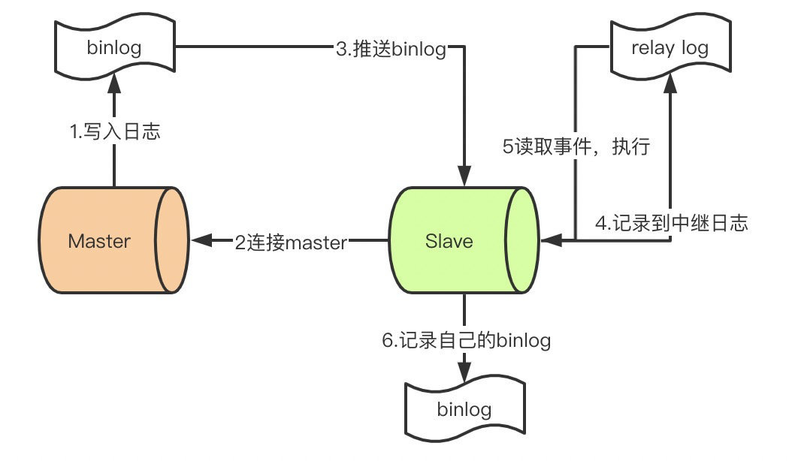

# MySQL 学习 | MySQL 的日志文件

常说的MySQL的三大日志文件，分别是Servcer层的`binlog`、innodb引擎的`undo log`和`redo log`。

## 1、Binlog

从名称可以看出，这是一种二进制格式的日志文件，引起数据库变化的语句会被记录到该日志中（如DDL、DML）。记录的格式可以分成三种:

- **Statement**: 基于SQL语句的复制，简称**SBR**，每一条会修改数据的SQL都被记录
- **Row**:基于行的复制，检查**RBR**，日志记录的是每一行数据被修改的情况
- **Mixed**:`Statement`与`Row`模式的混合，检查**MBR**，一般语句使用`statement`模式，当使用一些函数，无法保证主从一致时，使用`row`模式

MySQL5.7之前的版本默认使用**SBR **模式，8.0之前的版本模式使用**RBR**，8.0开始已经默认**MBR**模式。

使用命令`show global variables like '%binlog_format%';`查看当前MySQL使用的binlog模式。

启用`binlog`后会生成两类文件，一个是日志的索引文件，记录的是哪些日志文件被使用，文件后缀是`index`；一类是真正的日志文件，后缀`.00000*`。

通过命令`show binlog events in 'mysql-bin:000001'`或`mysqlbinlog mysql-bin.000001 `可以看到binlog记录的内容，下面是一个RBR模式的binglog日志内容：

由于启用的是RBR模式，所以想要看到DML语句需要使用`mysqlbinlog -vv mysql-bin.000001`

简单了解一些字段的意义：

**Log_name**：日志名称

**Pos**: 事件开始的位置，也是常说的位点。从上看，位点并不是从0开始，mysql通过日志文件的前4个字节来判断是不是一个binlog日志

**Event_type**：事件的类型

**Server_id**：mysql 服务的id，在`my.cof`中定义，通常不同服务的`server_id`要不一致，否则会导致同步异常

**End_log_pos**：下一次事件开始的位置

**Info**：事件具体的信息

### 1.2、Binlog 日志作用

binlog 日志的两个主要作用是**主从复制**和**故障恢复**。

#### **1.2.1、主从复制**

主从分离的数据库，就是通过主库binlog来做到数据一致。需要知道的是，主库向从库推送binlog，从库并不是直接从binlog读取写到库中，还需要经过`relaylog`，大概的模式如下图：

relay log 日志格式与binlog类似，多了`maser.info`和`relay-log.info`文件，master.info记录的是上次读取binlog位点，[relay-log.info](http://relay-log.info) 记录的是文件复制的进度，下一个事件开始位置。

#### **1.2.2、故障恢复**

数据库被误删或产生了大量脏数据怎么办？通过反解析binlog，可以快速恢复之前的数据。

#### **1.2.3、不同服务之间的数据同步**

拆分微服务后，服务A操作了后，也需要将数据同步到服务B，如何达到最终一致性？这里就可以读取mysql的binlog来做到，通过模拟从库，读取主库推送的binlog，将解析到的数据吐出，你可以异步更新redis缓存，es索引，或发送到MQ中，保证了数据的最终一致性。

开源平台上已经有很多成熟的解决方案，如阿里的canal。

## 2、Redo Log

`redo log`是`innoDB`引擎特有的日志，与之对于的`undo log`

### 参考连接

[【原创】研发应该懂的binlog知识(上) ](https://www.cnblogs.com/rjzheng/p/9721765.html)

[【原创】研发应该懂的binlog知识(下) ](https://www.cnblogs.com/rjzheng/p/9745551.html)

[MySQL中的binlog和relay-log结构完全详解](https://blog.csdn.net/qwe123147369/article/details/108670385)

[再深入一点|binlog和relay-log到底长啥样？ ](https://www.cnblogs.com/ilovejaney/p/13649345.html)

[带你了解 MySQL Binlog 不为人知的秘密](https://www.cnblogs.com/rickiyang/p/13841811.html)

[详细分析MySQL事务日志(redo log和undo log) ](https://www.cnblogs.com/f-ck-need-u/p/9010872.html)