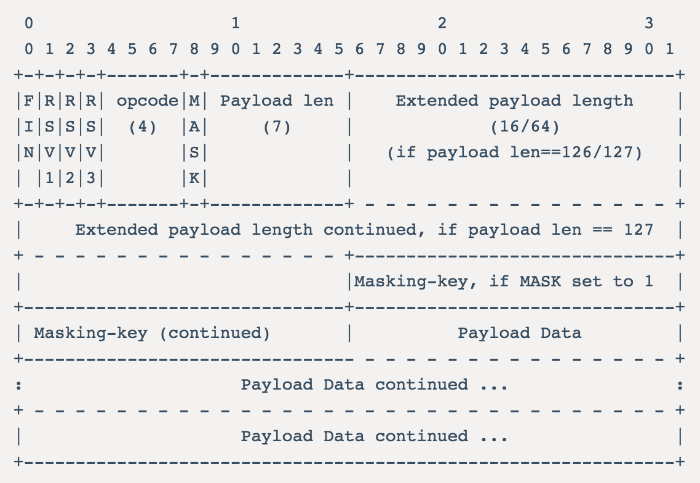

# PHPsocket编程之WebSocket


## 0x00 WebSocket基本知识

WebSocket 是一种在单个 TCP 进行全双工通信的协议。它允许客户端与服务端完成一次握手就可以建立永久的连接，双方可以进行双向的通信。在 Websocket 未出现之前，浏览器与服务端建立双向连接，通常是通过 ajax 轮询和 http 长连接来完成。

## 0x01 Socket基本知识

网络通信中，无论是浏览网页，网络聊天，观看视频都需要使用到 socket 进行通信。

打开 socket 需要确定协议族、套接字类型、协议类型。

socket 可用的协议族如下：
- AF_INET：IPv4网络协议
- AF_INET6 ：IPv6网络协议
- AF_UNIX：本地通信，绝对路径名

socket 可用的套接字类型：
- SOCK_STREAM：套接字不保留消息边界，保证发送和接受字节的顺序一致，保证发送的数据被无错的接受，数据是全双工的。常用于 TCP 协议中
- SOCK_DERAM：套接字不保证发送的顺序，不保证发送的正确性，也没有补救措施，数据大小固定
- SOCK_SEQPACKET：套接字与 **SOCK_STREAM** 套接字类似，提供有序，可靠，全双工的字节流，不同的是 **SOCK_SEQPACKET** 套接字固定长度，且保留消息边界
- SOCK_RAW：一种原始套接字，常用于手工构建一些协议
- SOCK_RDM：套接字保存数据可靠性，但不保证到达顺序

其中 SOCK_STREAM 被称为流式 socket，通常适用于 TCP 服务；SOCK_DERAM 被称为数据报式 socket，被用于无连接的 UDP 服务。

常见的可用的协议类型：
- TCP 协议
- UDP 协议
- ICMP 协议

socket连接的服务端建立流程如下

> socket -> bind -> listen -> accept -> send(or recv)

由上面介绍可以知道 websocket 基于 TCP 协议，数据发送是全双工方式，因此应该选择的协议族 AF_INET，选择的套接字为 SOCK_STREAM，协议类型为 TCP 协议（SOL_TCP）

## 0x02 PHP内置 socket 函数库

PHP 中的 socket 函数库是对 C 语言中socket的封装，使用 `socket_create`建立一个套接字，`socket_bind`绑定 ip 和 port，`socket_accept`接收套接字连接，`socket_listen`监听套接字，`socket_send`发送信息，`socket_recv`接收数据。

PHP socket库中用于建立 websocket 的包括如下函数：
- socket_create 建立一个 socket 套接字，包括声明 使用的协议类型，套接字类型，具体的协议
- socket_set_option 进行 socket 设置，包括指定使用的协议 level，套接字选项等
- socket_bind 为套接字绑定监视的 IP 和端口
- socket_listen 监听套接字上的连接
- socket_accept 接受套接字上的连接
- socket_connect 开启这个套接字连接，客户端使用它连接服务端
- socket_​send 向socket发送数据
- socket_recv 从已经连接的socket接收数据
- socket_select 指定的超时时间内容，确定传入的套接字数组中套接字状态，错误时返回 false，否则返回可用套接字数目
- ……

## 0x03 完成一个简单的 WebSocket 服务器

### 0、流程

利用 `socket_create`创建一个套接字，利用`socket_set_option`进行套接字设置，使用`socket_bind`绑定 IP 和 Port ，`socket_listen`监听套接字连接，`socket_select`选择状态正确的套接字，`socket_accept`接受对应的套接字连接，之后就可以使用`socket_recv`读取套接字连接中的数据，也可以使用`socket_send`对所有处于连接的套接字进行广播数据

### 1、建立套接字

`socket_create`接收三个参数，分别是协议类型，套接字类型，具体使用协议，WebSocket 建立在 TCP 协议上，所以这里选择 SOCK_STREAM，对应的协议常量为 SOL_TCP。

```PHP
// socket_create 的参数三 protocol 具体值可以调用 getprotobyname 来获取
// 该参数根据参数二 type 套接字类型来选择，选择 SOCK_STREAM 级表示使用 TCP 协议
// 那么应该传递 tcp 给 getprotobyname
// 也可以直接填写 通常 tcp 对应的 protocol 为 SOL_TCP
// UDP -> SOL_UDP
$master_task = socket_create(AF_INET, SOCK_STREAM, SOL_TCP);
// 要对套接字进行设置 就必须将 level 设置为 SOL_SOCKET 
// 这里是设置套接字地址可重用
socket_set_option($master_task, SOL_SOCKET, SO_REUSEADDR, 1);
// 绑定 IP 和 Port
socket_bind($master_task, $ip, $port);
// 监听连接 参数2是监听连接的数量，可以根据服务器不同设置不同数值 
// 小于等于该数值的连接进行队列等待处理，超出的会返回错误
socket_listen($master_task);

// 加入套接字列表中
$sockets[] = $socket_task;
```

### 2、检测合法套接字

这里用到了`socket_select`函数，该函数可以接收五个参数，前三个参数分别接收可读性、可写性、错误检测的套接字数组，四五两个参数组合成为该函数的超时等待时间，如果参数4设置为 0 ，此时该函数为非阻塞函数，可以直接返回，设置为 NULL，会进行阻塞，直到有一个套接字满足条件。这里我们直接将其设置为null

```PHP
// 循环内
$write = null;
$except = null;
$num = socket_select($sockets, $write, $except, null);
if (false === $num) {
  throw new Exception('error_select');
}
// 接收套接字 广播信息
```

### 3、接收套接字

使用`socket_accept`接收连接，如果接收成功会返回一个新的套接字，该新套接字可以用于通信。若成功返回，就可以进行发送握手信息（只需要发送一次）。

该函数与 socket_listen 配套使用，socket_listen 监听服务器主socket，使用socket_accept 接收连接服务器的socket，如上面诉述，接收成功之后，需要完成一次握手，握手成功后，才算成功建立 websocket 连接。


### 4、接收套接字信息

socket_recv 用来接收套接字信息，接收四个参数

- socket：套接字连接
- buffer：缓冲区字段
- length：接收字节数
- flag：接收标志，内容可以为下面参数或参数的组合，该参数一般置0(表示不指定任何标志)
  - MSG_OOB：值为1，表示处理超出边界的数据
  - MSG_PEEK：值为2，表示从接受队列的起始位置接收数据，但不将他们从接受队列中移除
  - MSG_WAITALL：值为256，表示在接收到至少 `len` 字节的数据之前，造成一个阻塞，并暂停脚本运行（block）。但是， 如果接收到中断信号，或远程服务器断开连接，该函数将返回少于 `len` 字节的数据
  - MSG_DONTWAIT：值为64，函数不会造成阻塞

如果接收出现错误，返回 false，通过 `socket_last_error` 读取错误代码，否则返回接收消息的字节数，若返回0，表示网络中断。

```
$bytes = socket_recv($socket, $buffer, $length, 0);
if ($bytes == 0) {
  socket_close($socket);
} else {
  // 判断是否已经握手
  // 如果已经握手 读取buffer数据
}
```

### 5、握手

websocket 需要进行一次握手连接后才能建立通信。通常由客户端发送协议升级的请求，服务端响应升级。

客户端发起的请求，必须是 GET 方式，header头必须包含以下参数：

- Connection: Upgrade。表示请求协议升级
- Upgrade: websocket。表示升级为 websocket 协议
- Sec-WebSocket-Version: 13。websocket 协议版本号，一般为 13。
- Sec-WebSocket-Key: *********。该报文与服务端响应的 Sec-WebSocket-Accept 配套，防止恶意链接

服务端接收到请求后，必须进行响应，表示协议已经升级，响应报文包含：

- Connection: Upgrade
- Upgrade: websocket
- Sec-WebSocket-Accept: *********。与 Sec-WebSocket-Key 组合通过指定算法计算而来。

计算方式为：

- Sec-WebSocket-Key 与 258EAFA5-E914-47DA-95CA-C5AB0DC85B11 连接
- 将连接后的字符串进行 sha1 ，之后生成 base64 字符串

完成上面握手后，即表示建立了 websocket 连接，可以进行通信了。

### 6、通信

由于协议通信通过数据帧，首先需要了解数据帧格式，如下图：



顺序为从左到右，包含了标识、操作代码、掩码、数据、数据长度等。

FIN、RSV1、RSV2、RSV3 各占一个 bit，其中 FIN = 1，表示是消息的最后分片，0 表示不是最后分片；RSV1~3 一般为0，这三个标志位可以非0，且值的含义由扩展进行定义。如果出现非零的值，且并没有采用WebSocket扩展，连接出错。

Opcode 占据4个 bit，它的值决定如何解析后续数据，操作码有如下：

      0x0 代表一个继续帧  
      0x1 代表一个文本帧
      0x2 代表一个二进制帧
      0x3-7 保留用于未来的非控制帧
      0x8 代表连接关闭
      0x9 代表ping
      0xA 代表pong
      0xB-F 保留用于未来的控制帧

其他操作码属于非法操作码。数据帧的第一个字节结束。

第二个字符由掩码和数据长度组成，其中掩码 Mask 占据一个 bit，表示是否要对数据载荷进行掩码操作。如果Mask是1，那么在Masking-key中会定义一个掩码键（masking key），并用这个掩码键来对数据载荷进行反掩码。只有客户端发送数据时需要添加掩码，且值都为1，如果服务端没有接收到掩码，需要断开连接。

第二个字符剩余部分(占据7个bit)为数据载荷 payload length，单位是字节，含义如下：

- 126：payload length后面连续 2 个字节都是数据长度范围
- 127：payload length后面连续 8 个字节都是数据长度范围
- 0~126：payload length 的值即为数据长度

payload length 之后，如果申明了 Mask，且值为 1，会有占据 4 个 byte 的 Masking Key
Masking-key 之后即为正式数据。

根据上面图片及描述，可以获取掩码和数据，首先计算payload length的值，获取数据帧的第二个字节，排除mask值，即为 payload length 的值。去除 mask 值得方法也会简单，将第二个字节与`0x7F`相与即可。

代码如下：

```php
$length = $buffer[1] & 0x7F;
if ($length === 126) {
  // length == 126 payload length 后面连续 2 个字节都是数据长度范围
  // masking key 在第 4 个字节之后
  $mask = substr($buffer, 4, 4);
  $data = substr($buffer, 8);
} elseif ($length === 127) {
  // length == 126 payload length 后面连续 8 个字节都是数据长度范围
  // masking key 在第 10 个字节后
  $mask = substr($buffer, 10, 4);
  $data = substr($buffer, 14);
} else {
  // length 0~126 payload length 的值即为数据长度
  // masking key 在第 2 个字节后
  $mask = substr($buffer, 2, 4);
  $data = substr($buffer, 6);
}
```

获取了掩码和数据后，需要运用掩码算法进行反掩码，算法公式如下：

    transformed[i] = original[i] ^ masking[i % 4];

original 表示为原始数据，masking 表示为掩码key，data[i] 表示第 i 个字节的数据，所以转换代码如下：

```
$size = strlen($data);
for ($i = 0; $i < $size; $i++) {
  $decode .= $data[$i] ^ $mask[$i % 4];
}
```

上面为读取客户端发送的数据帧，下面说明如何组合数据帧发送给客户端。

数据帧格式与客户端发送数据帧格式基本一致，第一个字节一般为`0x81`，表示是消息的最后分片且是一个文本数据帧。

因为服务端发送到客户端，所以可以不发mask，判断数据长度，生成payload length后，第二个字节就完成了：

```
$i = 0;
$frame[$i++] = 0x81;
$size = strlen($message);

if ($size < 126) {
    // < 126 payload length 为数据长度 
    $frame[$i++] = dechex($size);
} elseif ($size < 65535) {
    // 第二种 payload length 后2个字节 16 unsigned bit 表示数据长度
    $frame[$i++] = ox7e;
    $hex = dechex($size);
    $hex = str_repeat(0, 4-strlen($hex));
    $hexArray = str_split($hex, 2);
    $frame[$i++] = $hexArray[0];
    $frame[$i++] = $hexArray[1];
} else {
    // 第三种 payload length 后 8 个字节 64 unsigned bit 表示长度
    $frame[1] = ox7f;
    $hex = dechex($size);
    $hex = str_repeat(0, 8-strlen($hex));
    $hexArray = str_split($hex, 2);
    foreach($hexArray as $item) {
        $frame[$i++] = $item;
    }
}

// 将数据转为二进制
$data = ''; 
for ($i = 0; $i < $size; $i++) {
    $data .= dechex(ord($msg[$i])); 
}
$frame[$i++] = $data;

$frames = implode('', $frame);

// 打包为十六进制字符串
return pack('H*', $frames);
```

### 7、广播

完成数据组装后就可以发送数据了，使用`socket_write`发送数据，该函数接收三个参数，包括socket套接字，数据集，数据长度。

此时也可以选择指定套接字通信，也可以对所有连接的套接字广播。

到此，一个简单的 websocket 服务器就搭建好了。

## 参考链接

[UNIX网络编程——原始套接字SOCK_RAW](https://blog.csdn.net/ctthuangcheng/article/details/9733619)