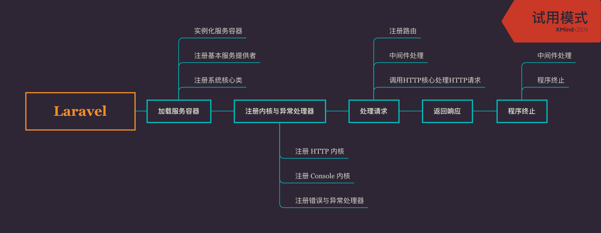

# 0. 生命周期

阅读 Laravel 入库文件 index.php，可以看出整个框架的生命周期大致分成：

- 创建服务容器
- 注册 http 处理器、错误与异常处理器
- 实例化 http 处理器并接收处理请求
- 返回请求响应结果
- http 处理器结束，处理后置中间件、回调程序

而整个生命周期中，比较核心的程序是：

- Http 处理器
- 服务容器
- 请求调度程序，包括路由、中间件

其中，贯穿全框架的程序，包括：

- 服务提供者
- Facades
- Contacts



上面图是 Laravel 的生命周期思维导图

下面是入口文件

```php
<?php

// 一个毫秒级的常量
// 记录的是 Laravel 接收请求开始时间
// 想要记录接口响应时间 可以使用到这个常量
define('LARAVEL_START', microtime(true));

// 引入 composer 自动加载
require __DIR__.'/../vendor/autoload.php';


// 创建服务容器、注册http内核
// Laravel 的服务容器是一个很强大的Ioc容器
// 框架中许多操作都依赖该容器 是 Laravel 核心之一
// app.php 除了创建服务容器 还注册了 http 内核、Console 内核以及异常处理器
$app = require_once __DIR__.'/../bootstrap/app.php';

// 创建（实例化）http内核
$kernel = $app->make(Illuminate\Contracts\Http\Kernel::class);

// 接收一个Http请求 加载路由、加载中间件等处理请求
// 并返回响应
$response = $kernel->handle(
    $request = Illuminate\Http\Request::capture()
);

// 返回响应
$response->send();

// 响应返回后 http核心继续处理请求后中间件、回调程序
$kernel->terminate($request, $response);
```

