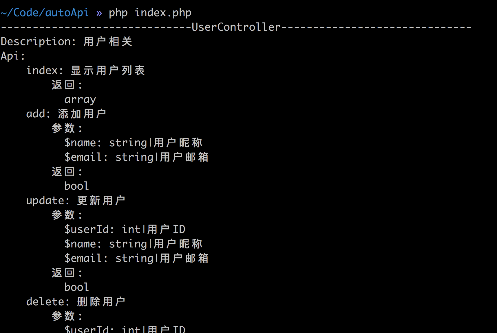

# 了解反射

反射在物理学中是指波在抵达媒质界面时发生折回传播的现象；在生物学中是指对一定刺激的模式化、非自主的反应。在计算机科学中把在程序运行时能访问、检测和修改它本身状态的一种能力叫做反射。

通俗的说，程序运行时，你能通过反射知道任意一个类的所有属性和方法；能够调用对象的任意一个属性和方法；甚至能知道类起始和终止行数。这个类在反射面前清清楚楚，没有一点隐私。

有了反射的这种特性，就可以完成很多有意思的东西。

**实现 IoC 容器**

在依赖倒置原则中，解决了上下层模块的依赖问题，使其都依赖于一个抽象。而在实际使用中，还是需要手动硬编码去实例化这个抽象。我们如果只想关系对象的使用，而不关系如何获取这个对象，要怎么办？这就是控制反转中所需要做的事。

把实例化对象这个控制权交出去，只关心具体业务逻辑，这样让整体结构更为清晰。那么怎么做到这点，就需要使用到反射机制了。

在需要使用类的方法中声明，利用反射机制获取这个类的信息，实例化后自动传递给方法，被称为依赖注入。而整个 IoC 容器实现的基础就是反射机制。

**实现API文档自动化生成**

反射的简单应用，通过获取方法的注释、参数等自动的生成接口文档。

**单元测试**

使用反射获取类对象，获取类方法，执行方法并返回结果。

在比如 Java 中功能强大的注解也是通过反射完成的。

## PHP反射机制

在 PHP5 版本中已经添加了对反射机制的完整支持，所以上面所述的内容，在 PHP 中都可以实现。

实例化 ReflectionClass 类后，调用`getConstructor`获取构造方法的信息，`getDocComment`获取类注释，还可以获取类命名空间，获取类方法列表，获取类常量和属性等。详情请去看反射文档，快捷入口[反射](http://php.net/manual/zh/book.reflection.php)

下面通过反射简单实现一个自动接口文档生成方法：

```php
function docApi($classname)
{
    $ref = new ReflectionClass($classname);
    echo str_repeat('-', 30), $ref->getName(), str_repeat('-', 30), PHP_EOL;

    $classDoc = parseDoc($ref->getDocComment());
    echo 'Description: ', $classDoc['desc'], PHP_EOL;
    //
    // // 获取方法列表
    $methods = $ref->getMethods();
    echo 'Api:', PHP_EOL;
    /** @var $method ReflectionMethod */
    foreach($methods as $method) {
        // api 是公开方法
        if ($method->isPublic() === false) {
            continue;
        }
        // doc
        $methodDoc = parseDoc($method->getDocComment());

        echo str_repeat(' ', 4), $method->getName(), ': ', $methodDoc['desc'], PHP_EOL;
        if (!empty($methodDoc['params']['param'])) {
            echo str_repeat(' ', 8), '参数:', PHP_EOL;
            foreach ($methodDoc['params']['param'] as $type => $param) {
                echo str_repeat(' ', 10), $param['name'], ': ', $param['type'], '|', $param['desc'],PHP_EOL;
            }
        }
        if (!empty($methodDoc['params']['return'])) {
            echo str_repeat(' ', 8), '返回:', PHP_EOL;
            echo str_repeat(' ', 10), $methodDoc['params']['return']['type'];
            echo empty($methodDoc['params']['return']['desc']) ? '': ': ', $methodDoc['params']['return']['desc'], PHP_EOL;
        }
    }

    echo PHP_EOL;
}
```

效果如下：



功能很简单，代码也很简单，有兴趣可以自己手撸一个，哈哈哈。
代码中的`parseDoc`是我写的一个解析注释的函数，很简单，利用正则去解析注释内容，代码就不贴出了，GitHub中有很多。

啰嗦了一大串，我其实是想说一下IoC容器的事，感觉字也不少了，下一篇来说一下吧，顺便学习一下 Laravel 的服务容器。