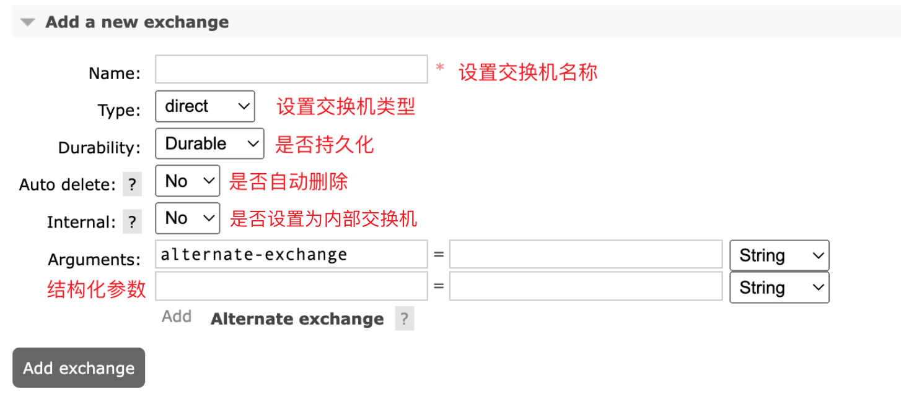
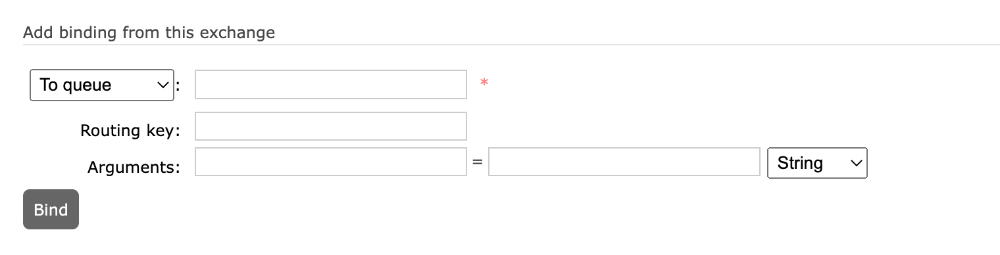

# Exchange 的四种类型


## 1. 交换机的作用

消息队列的两端是生产者与消费者，消息的承载体被称作队列；在 RabbitMQ 中，生产者不能直接将消息投递给队列，需要先将消息投递到 exchange 中，再由 exchange 根据绑定的 routering key 分发到队列中。

**那为什么不能直接由生产者发消息给队列呢？**

这里 exchange 的主要作用是解耦，毕竟消息队列存在多种场景，有点对点、有群发、有发给模式匹配的队列等，如果均由生产者来完成，那每个生产者都需要写一套发送逻辑，耦合性很强；引入 exchange，通过对 exchange 配置，生产者不用关心具体发送给哪些队列，而专注消息生产。

## 2. Exchange 的四种类型

根据 AMQP 协议，exchange 有四种类型，direct、fanout、topic、header，下面分别介绍四种类型及其使用场景。

### 2.1 Direct|直连交换机

direct exchange 通过消息携带的 routing key 来分发消息到队列中。使用 direct exchange 需要在创建后设置一个 routing key 将交换机绑定到对应的队列中，当消息到交换机中，根据消息携带的 key ，交换机会将消息分发给绑定 key 的队列。

同一个 routing key 可以绑定多个队列，当交换机发现存在多个队列时，会循环分发任务。


### 2.2 fanout|扇形交换机

扇形交换机类似广播的概念，扇形交换机不需要设置routing key ，当消息来的时候，扇形交换机会将消息分发给每个绑定的队列。

扇形交换机使用在于需要广播消息的场景，例如将某个系统数据同步在其他多个系统中。


### 2.3 topic|主题交换机

主题交换机与直连交换机一样，需要绑定 routeing key 到队列；与直连不同的是，主题交换机的 routing key 必须是以`.`分割的单词列表，在消息分发时通过模式匹配发送消息到对应的队列中

目前主题交换机支持两种匹配关键词：`#`、`*`

**#**: 匹配0个以上的单词，例如：`test.#`匹配`test.`后接任意个单词

*****: 匹配1个单词，例如：`test.*`仅能匹配`test.one`,无法匹配`test.one.two`


### 2.4 header|头交换机


## 3. 创建交换机

### 3.1 WebUI创建

1. 添加交换机



Web 创建交换机如下，介绍一下几个参数的含义：

- Name: 交换机名称，必填，交换机创建后，生产者/消费者通过该名称指定交换机
- Type: 交换机类型，可选 direct、fanout、topic、header四种
- Durability: 是否持久化，可选 Durable、Transient，选择 Transient 后，当 Broker 重启后，该交换机会消失
- Auto delete: 是否自动删除，可选 No、Yes，选择 Yes 后，当绑定的队列全部删除，该交换机自动删除
- Internal: 是否设置内部交换机，可选 No、Yes，选择 Yes，外部消息不可发送给改交换机，仅可以由其他交换机转发
- Arguments: 参数，RabbitMQ 提供了一个参数 alternate exchange，可以设置另一个交换机，当消息没有找到对应的队列时会被转发到该交换机


2. 绑定队列



交换机中的绑定操作既可以绑定队列，也可以绑定其他交换机；与绑定队列类似，消息会根据 routing key 来分发到绑定的交换机中，在该交换机中又会再次根据 routing key 分发到绑定的队列或交换机中。

### 3.2 代码创建

#### 3.2.1 php

php 的 rabbitmq 的客户端可以使用rabbitmq官方提供的 php-amqplib 包，也可使用c拓展php-amqp，如何安装这里就不演示了

**使用 amqp 创建**

```php

try {
    // 1. 创建与 amqp 服务器的连接
    $conn = new AMQPConnection();
    // 1.1 设置连接参数
    $conn->setHost('127.0.0.1');
    $conn->setPort(5672);
    $conn->setLogin('test');
    $conn->setPassword('111111');
    // 1.2 开始请求连接
    $conn->connect();

    // 2. 创建信道
    $channel = new AMQPChannel($conn);

    // 3. 创建/声明交换机
    $exchange = new AMQPExchange($channel);
    // 3.1 设置交换机类型
    $exchange->setType(AMQP_EX_TYPE_DIRECT);
    // 3.2 设置交换机名称
    $exchange->setName('direct_test:' . time());
    // 3.3 设置交换机持久化
    $exchange->setFlags(AMQP_DURABLE);

    // 3.4 声明/创建交换机 当该交换机不存在时会被创建
    $exchange->declareExchange();

} catch (\Exception $exception) {
    echo $exception->getTraceAsString();
}
```

**使用 php-amqplib **


#### 3.2.2 golang

Golang 可以使用`streadway/amqp`。

```go
	// 连接rabbitmq服务器
	url := fmt.Sprintf("amqp://%s:%s@%s:%d/%s", "test", "111111", "126.0.0.1", 5672, "/")
	conn, err := amqp.Dial(url)
	if err != nil {
		panic(err)
	}
	defer conn.Close()

	// 定义信道
	channel, err := conn.Channel()
	if err != nil {
		panic(err)
	}
	defer channel.Close()

	// 定义交换机
	err = channel.ExchangeDeclare(
		"test_direct_second",  // name
		"direct", // type
		true, // durable
		false, // auto_delete
		false, // internal
		false, // no_wait
		nil, // arguments
	)
	if err != nil {
		panic(err)
	}
```


> 参考链接
>
> [AMQP 0.9.1 模型解析 · RabbitMQ in Chinese (mr-ping.com)](http://rabbitmq.mr-ping.com/AMQP/AMQP_0-9-1_Model_Explained.html#直连交换机)