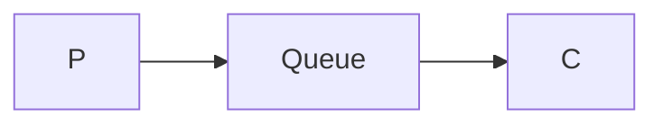
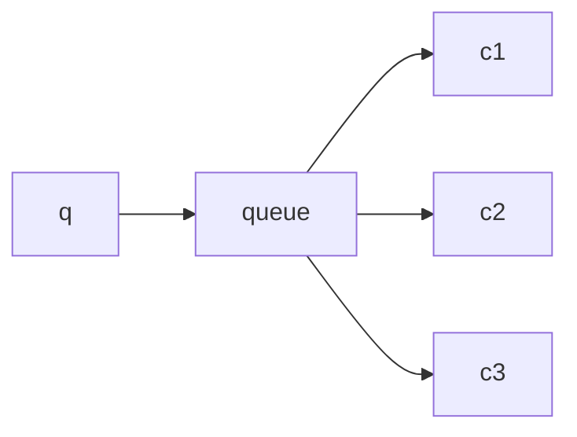

# RabbitMQ的六种工作模式

### simple 模式

使用direct exchange，当只有一个消费者消费时，就是一个simple模式，消息通过交换机发往队列并直接被消费者消费。甚至如果使用的是rabbitmq默认的交换机，那么在生产或消费时可以不用声明交换机，这时工作模型类似于下图：

### work 模式

在 simple 模式基础上增加多个消费者，就是 work 模式；simple 模式下只能一个消费者消费，消费能力有限，可能会导致消息堆积，增加多个消费者能显著提高消费能力，但是存在的问题是保证一个消息只能被一个消费者消费。

work 模式下提供了两种方案：

1. 轮询分发
2. 公平分发

**轮询分发**是默认使用的分发方案，循环对每个消费者分发一条消息，例如有消息m1~m5，消费者c1~c3，那么每个消费者分的消息是：

> C1: m1、m4
>
> C2: m2、m5
>
> C3: m3

该种方案均匀分配，与实际消费者能力无关，因此可能出现c2早已消费玩，c1还在消费第一条消息的情况。

**公平分发**则不是均匀分配消息，会考虑到消费者的消费能力分发消息，消费速度快的得到更多消息。实际上，公平分发是基于轮询的变种，当消费者声明不要发送超过1条消息给消费者，直到上一条消息消费成功并返回响应。这样，当该消费者没有消费玩消息时，当前消息会被分发到其他有能力消费的消费者。

设置的方式是使用`basic.qos` api，设置 prefetch_count=1。

### 发布-订阅模式

